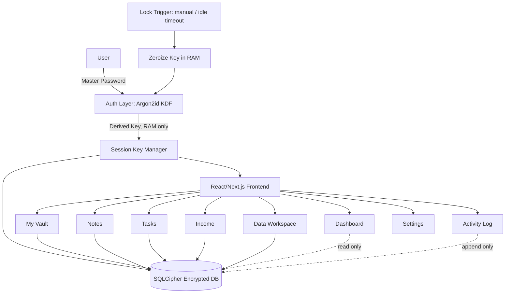

# 🔐 SECRET — Master Project Plan (plan.md)

**Single-User, Offline-First, Encrypted Desktop Workspace**

> This document is the authoritative source of truth for any AI coding agent, human developer, or reviewer working on this project. Every module, schema, and phase below is binding. Do not deviate from architectural decisions in this document without explicitly flagging the change and updating this file.

---

## 0. Project Identity

| Field                 | Value                                                                                           |
| --------------------- | ----------------------------------------------------------------------------------------------- |
| **Project Name**      | Secret                                                                                          |
| **Type**              | Desktop Application                                                                             |
| **Deployment Model**  | 100% Offline, Local-First, Single-User                                                          |
| **Security Posture**  | Zero-Knowledge, Zero Cloud Exposure                                                             |
| **Primary Objective** | A hardened personal vault + productivity workspace + financial ledger + local analytics station |

**Non-negotiable constraints (apply to every phase, every agent, every PR):**

1. No network calls of any kind outside of local IPC between the frontend and the Rust/Electron backend. No telemetry, no update-check pings, no font/CDN fetches at runtime.
2. All persisted data lives inside a single SQLCipher-encrypted database file.
3. Master key material exists in memory only, is zeroized on lock/timeout/exit, and is never logged, serialized, or written to disk in plaintext.
4. Every write to sensitive tables must be paired with an `activity_logs` entry.
5. UI is dark by default and restricted to the two-color system defined in §4 (`#0F0E0D` obsidian, `#F4EDE4` bone) — no third color, no light-mode variant in v1.

---

## 1. Executive Summary

Secret is a hardened, single-user desktop application combining a zero-knowledge password/credential vault, a Markdown notes system, a task manager, a personal income ledger, and a local data-analytics workspace — all backed by one AES-256-encrypted SQLite database (SQLCipher), with keys derived via Argon2id and held only in volatile memory during an active session.

The product is architected as **one encrypted source of truth** with **six modules** sitting on top of it, plus two system-level utilities (Activity Log, Settings) and one hard security control (Lock).

---

## 2. System Architecture

### 2.1 High-Level Diagram



### 2.2 Process/Trust Boundary

- **Renderer process (frontend):** never touches the encryption key or raw SQLCipher connection directly. It communicates only through a typed IPC bridge (Tauri commands or Electron `ipcMain`/`contextBridge`).
- **Main/core process (backend):** owns the SQLCipher connection, the Argon2id key derivation, session key lifecycle, and clipboard timers.
- **Rationale:** even if the renderer is compromised (e.g. malicious dependency, XSS in a Markdown preview), it cannot exfiltrate the master key because it never has it.

### 2.3 Directory Structure

```
secret/
├── src-core/                  # Rust (Tauri) or Node main process (Electron)
│   ├── auth/
│   │   ├── kdf.rs             # Argon2id derivation
│   │   └── session.rs         # In-memory key lifecycle, auto-lock timer
│   ├── db/
│   │   ├── connection.rs      # SQLCipher open/close/rekey
│   │   ├── migrations/
│   │   └── repositories/      # vault, notes, tasks, income, data, logs
│   ├── ipc/                   # Command handlers exposed to frontend
│   └── backup/                # .enc export/import engine
├── src/                       # React/Next.js frontend
│   ├── app/ or pages/
│   ├── components/
│   │   ├── dashboard/
│   │   ├── vault/
│   │   ├── notes/
│   │   ├── tasks/
│   │   ├── income/
│   │   ├── data-workspace/
│   │   ├── activity-log/
│   │   └── settings/
│   ├── lib/
│   │   ├── ipc-client.ts      # Typed wrapper around backend commands
│   │   ├── password-gen.ts    # Client-side generator (no key material)
│   │   └── entropy.ts
│   ├── state/                 # Session/auth state, lock state
│   └── styles/                # Tailwind config wired to §4 obsidian/bone tokens
├── plan.md                    # ← this file
└── README.md
```

---

## 3. Module Specification

| #   | Module             | Purpose                          | Key Features                                                                                                                                                                   |
| --- | ------------------ | -------------------------------- | ------------------------------------------------------------------------------------------------------------------------------------------------------------------------------ |
| 1   | **Dashboard**      | System overview / landing screen | Summary counters (credentials, notes, active tasks, monthly income), upcoming-task widget with priority indicators, recent income feed, DB health + backup-freshness indicator |
| 2   | **My Vault**       | Zero-knowledge credential store  | Masked password field, provider-domain icon resolution, favorite toggle, copy-to-clipboard with 30s auto-clear, full CRUD                                                      |
| 3   | **Notes**          | Markdown developer notepad       | Write/Preview dual mode, folder taxonomy, tag filtering, full-text search                                                                                                      |
| 4   | **Tasks**          | Grouped task manager             | Columns: `To Do` / `In Progress` / `Done`; priority badges (`Low`/`Medium`/`High`); custom tags; due dates; inline status toggle                                               |
| 5   | **Income**         | Personal finance ledger          | Header stats (This Month, All-Time, Total Entries); category tags (Consulting, Freelance, Revenue, Bonus); tabular ledger with currency formatting                             |
| 6   | **Data Workspace** | Local analytics station          | Import CSV/JSON/SQL dumps into isolated local tables; high-performance sortable/filterable grid; anonymization utility for sensitive columns                                   |
| 7   | **Activity Log**   | Immutable local audit trail      | Append-only log of sensitive actions (`Password Copied`, `Note Created`, `Failed Unlock Attempt`, `Backup Exported`) with exact timestamps                                     |
| 8   | **Settings**       | App configuration                | Master password change/rotation, auto-lock timeout, theme tokens, encrypted `.enc` backup export/import                                                                        |
| 9   | **Lock**           | Hard security control            | Instantly zeroizes the session key, clears sensitive UI state, returns to unlock screen                                                                                        |

---

## 4. Design System & Visual Identity

> This section is binding for every screen, component, and state in the app. No component ships with a color, gradient, or visual treatment outside what's defined here without this section being updated first.

### 4.1 Design Philosophy

Minimalist, premium, quiet-luxury. The interface should feel like a high-end hardware product (think: a premium safe, not a SaaS dashboard) — restrained, confident, dark, with cream/bone accents used sparingly as the "reveal" moment (unlocked state, active selections, primary actions). No visual noise: no drop shadows stacked on drop shadows, no more than one accent treatment per screen, generous whitespace, and typography doing most of the hierarchy work rather than color.

### 4.2 Color System — Two Colors Only

| Token                     | Hex       | Role                                                            |
| ------------------------- | --------- | --------------------------------------------------------------- |
| `--color-obsidian` (base) | `#0F0E0D` | Primary background, near-black surfaces, default UI chrome      |
| `--color-bone` (accent)   | `#F4EDE4` | Primary text, primary buttons, active/focus states, key accents |

**Hard rule: no third color is introduced.** All depth, hierarchy, and state are created through opacity/alpha variants and gradient blends of these two colors only — never a new hue (no blues for "info," no reds for "error" as a _color swap_; use bone-on-obsidian weight/opacity/iconography instead, per §4.5).

**Derived tokens (opacity variants, not new colors):**

```css
:root {
  --color-obsidian: #0f0e0d;
  --color-bone: #f4ede4;

  /* Obsidian surface layers — for depth without a new hue */
  --surface-base: var(--color-obsidian);
  --surface-raised: rgba(244, 237, 228, 0.03); /* card on top of base */
  --surface-raised-hover: rgba(244, 237, 228, 0.06);
  --border-subtle: rgba(244, 237, 228, 0.08);
  --border-default: rgba(244, 237, 228, 0.14);

  /* Bone text/foreground layers */
  --text-primary: var(--color-bone);
  --text-secondary: rgba(244, 237, 228, 0.64);
  --text-tertiary: rgba(244, 237, 228, 0.38);
  --text-disabled: rgba(244, 237, 228, 0.2);

  /* Interactive */
  --accent-solid: var(--color-bone);
  --accent-on-accent: var(
    --color-obsidian
  ); /* text/icon color when sitting ON a bone-filled element */
}
```

### 4.3 Gradient Usage (the only two-color gradient permitted)

- **Primary gradient:** `linear-gradient(135deg, #0F0E0D 0%, #1A1815 100%)` — an obsidian-only gradient (subtle lightening, not toward bone) used on large background surfaces (app shell, sidebar, dashboard hero) to avoid a flat, cheap-looking fill.
- **Accent gradient (sparingly):** `linear-gradient(135deg, #F4EDE4 0%, #E4D9C8 100%)` — a bone-only gradient (subtle warming, not toward obsidian) used only on primary CTAs (`Unlock`, `Save`, `Generate Password`) and the active nav-item indicator. Max one accent-gradient element visible per screen at rest.
- **Never blend obsidian directly into bone in a single gradient** (i.e. no `linear-gradient(#0F0E0D, #F4EDE4)`). That reads as a generic dark-mode toggle effect, not premium — it also fails contrast in the middle of the blend. Keep the two gradients (§ obsidian-family, § bone-family) visually separate; let sharp edges/borders do the contrast work between them, not a blended transition.

### 4.4 Typography

- **Primary typeface:** a refined sans (e.g. `Inter`, `Söhne`, or `General Sans`) for UI chrome; bundled locally as a font file — no CDN/Google Fonts fetch (violates the offline constraint in §0).
- **Monospace:** for anything data-like — passwords (masked/unmasked), entropy bits, table/grid contents, activity-log timestamps, note code blocks. Bundled locally (e.g. `JetBrains Mono` or `IBM Plex Mono`).
- **Hierarchy via weight and size, not color:** headings at 500–600 weight, body at 400, secondary/meta text uses `--text-secondary` opacity rather than a lighter tint — do not introduce grays outside the bone-opacity scale.
- **Letter-spacing:** slightly widened tracking (`0.01–0.02em`) on all-caps labels (section headers, badges) to reinforce the premium/editorial feel.

### 4.5 State & Semantic Meaning Without New Colors

Since only obsidian and bone exist, status/priority/severity must be communicated through **weight, opacity, iconography, and shape** — not hue:

- **Priority badges** (`Low`/`Medium`/`High`): differentiate via filled vs. outlined vs. bold-filled bone treatment, plus an icon (dot / half-fill / full-fill), not red/yellow/green.
- **Task status columns:** differentiate via border weight and background opacity step (`To Do` = subtle outline only, `In Progress` = `--surface-raised`, `Done` = `--surface-raised` + reduced text opacity to imply completion/fade).
- **Errors / failed unlock:** communicated via icon (e.g. an alert glyph), motion (a subtle shake), and bone-on-obsidian at full opacity with bold weight — not a red state. If a task genuinely requires a distinct error color, flag it for explicit sign-off before adding a third hue; the default expectation is _no third color, ever_.
- **Favorites / active states:** solid bone fill with obsidian icon/text on top (`--accent-on-accent`), reserved for the single most important action or item on a given screen.

### 4.6 Component Treatment

- **Cards:** `--surface-raised` background, 1px `--border-subtle`, generous internal padding (24–32px), no drop shadow at rest; on hover, border steps to `--border-default` and background to `--surface-raised-hover` — no shadow, no scale-jump; a slow (150–200ms) ease is enough.
- **Buttons — primary:** accent-gradient fill (§4.3), `--accent-on-accent` text, no border, subtle press-state scale (0.98).
- **Buttons — secondary/ghost:** transparent fill, `--border-default`, `--text-primary` text.
- **Inputs:** transparent/`--surface-raised` background, `--border-subtle` at rest, `--border-default` or full-opacity bone on focus (no glow/box-shadow halo — a clean border-color shift only).
- **Modals:** `--surface-base` with a slightly stepped-up obsidian gradient (§4.3) and a 1px `--border-subtle` edge; avoid a heavy scrim — a light obsidian-at-70%-opacity backdrop is enough given the app is already dark.
- **Icons:** single-weight line icons only (no filled/line mixing), always bone at `--text-primary` or `--text-secondary`, never a third color.

### 4.7 Motion

- Motion is restrained and functional, never decorative-for-its-own-sake: unlock transition, card hover, tab switch, modal open/close.
- Standard easing: `cubic-bezier(0.16, 1, 0.3, 1)` (a confident, premium "settle" curve), 150–250ms for micro-interactions, up to 400ms for the unlock/lock full-screen transition.
- No bouncy/spring overshoot — it reads as playful, not premium.

### 4.8 Accessibility Within a Two-Color System

- Body text (`--text-primary` on `--surface-base`) must maintain ≥ 7:1 contrast — `#F4EDE4` on `#0F0E0D` comfortably exceeds this.
- Secondary text (`--text-secondary`, 64% opacity) must still clear ≥ 4.5:1 — verify against `--surface-base`, not against a raised card, since opacity math compounds when stacked on `--surface-raised`.
- Never drop below `--text-tertiary` (38%) for anything conveying information — reserve sub-38% opacity purely for disabled states.

---

## 5. Credential Creation & Smart Password Generator

### 5.1 Credential Modal Fields

- **Account Name** — friendly label (e.g. `GitHub Main`)
- **Provider URL** — domain used to resolve a brand icon locally (bundled icon set + simple domain matcher; no live favicon fetching, since that would violate the offline constraint)
- **Username / Email** — plain text, single-click copy
- **Password** — obfuscated input, visibility toggle, fast copy, "Generate" button wired to the Smart Generator

### 5.2 Smart Password Generator

- **Length Slider:** 8–64 characters, default 18
- **Rule toggles:** Uppercase (`A-Z`), Lowercase (`a-z`), Digits (`0-9`), Symbols (`!@#$%^&*()_+-=[]{}|;:,.<>?`), Exclude Ambiguous (`1 l I 0 O`)
- **Entropy display:** `E = L × log2(N)` computed live, with a labeled strength meter (e.g. Weak / Fair / Strong / Excellent)
- **Generation must happen in the frontend using a CSPRNG** (`crypto.getRandomValues`), never `Math.random()`.

---

## 6. Technical Stack

| Layer                | Choice                                                                                       | Rationale                                                                                                    |
| -------------------- | -------------------------------------------------------------------------------------------- | ------------------------------------------------------------------------------------------------------------ |
| Desktop Shell        | **Tauri (Rust)** — preferred over Electron                                                   | ~15MB footprint, native Rust memory safety for the key-holding core process                                  |
| Frontend             | **React / Next.js + TypeScript**                                                             | Strict typing across IPC boundary reduces class of runtime bugs touching sensitive data                      |
| Styling              | **Tailwind CSS**, configured with the `--color-obsidian` / `--color-bone` token system in §4 | Fast, consistent enforcement of the two-color minimalist-premium system — no ad-hoc hex values in components |
| Database             | **SQLCipher (SQLite + AES-256)**                                                             | Full-database encryption at rest, battle-tested                                                              |
| Key Derivation       | **Argon2id**                                                                                 | Memory-hard, GPU/ASIC brute-force resistant                                                                  |
| Animation (optional) | **Framer Motion**                                                                            | Micro-interactions on unlock, card transitions                                                               |

---

## 7. Database Schema (authoritative DDL)

```sql
-- Vault Credentials
CREATE TABLE vault_credentials (
    id TEXT PRIMARY KEY,
    account_name TEXT NOT NULL,
    username_email TEXT NOT NULL,
    encrypted_password TEXT NOT NULL,
    provider_url TEXT,
    icon_svg_or_path TEXT,
    tags TEXT,
    is_favorite BOOLEAN DEFAULT 0,
    created_at DATETIME DEFAULT CURRENT_TIMESTAMP,
    updated_at DATETIME DEFAULT CURRENT_TIMESTAMP
);

-- Notes
CREATE TABLE notes (
    id TEXT PRIMARY KEY,
    title TEXT NOT NULL,
    content_markdown TEXT,
    folder_id TEXT,
    is_favorite BOOLEAN DEFAULT 0,
    created_at DATETIME DEFAULT CURRENT_TIMESTAMP,
    updated_at DATETIME DEFAULT CURRENT_TIMESTAMP
);

-- Note Folders
CREATE TABLE note_folders (
    id TEXT PRIMARY KEY,
    name TEXT NOT NULL,
    parent_id TEXT,
    created_at DATETIME DEFAULT CURRENT_TIMESTAMP
);

-- Tasks
CREATE TABLE tasks (
    id TEXT PRIMARY KEY,
    title TEXT NOT NULL,
    description TEXT,
    status TEXT DEFAULT 'To Do',       -- 'To Do' | 'In Progress' | 'Done'
    priority TEXT DEFAULT 'Medium',    -- 'Low' | 'Medium' | 'High'
    tags TEXT,
    due_date DATE,
    created_at DATETIME DEFAULT CURRENT_TIMESTAMP
);

-- Income Entries
CREATE TABLE income_entries (
    id TEXT PRIMARY KEY,
    entry_date DATE NOT NULL,
    description TEXT NOT NULL,
    category TEXT NOT NULL,            -- 'Consulting' | 'Freelance' | 'Revenue' | 'Bonus' | custom
    amount REAL NOT NULL,
    created_at DATETIME DEFAULT CURRENT_TIMESTAMP
);

-- Data Workspace: imported dataset registry
CREATE TABLE data_imports (
    id TEXT PRIMARY KEY,
    source_name TEXT NOT NULL,
    source_type TEXT NOT NULL,         -- 'csv' | 'json' | 'sql'
    table_name TEXT NOT NULL,          -- isolated local table this import created
    row_count INTEGER DEFAULT 0,
    anonymized BOOLEAN DEFAULT 0,
    imported_at DATETIME DEFAULT CURRENT_TIMESTAMP
);

-- System Audit Logs (append-only; no UPDATE/DELETE permitted at the app layer)
CREATE TABLE activity_logs (
    id TEXT PRIMARY KEY,
    action_type TEXT NOT NULL,
    details TEXT,
    timestamp DATETIME DEFAULT CURRENT_TIMESTAMP
);

-- App Settings (single row)
CREATE TABLE app_settings (
    id INTEGER PRIMARY KEY CHECK (id = 1),
    auto_lock_minutes INTEGER DEFAULT 5,
    clipboard_clear_seconds INTEGER DEFAULT 30,
    theme TEXT DEFAULT 'dark',
    last_backup_at DATETIME
);
```

**Indexing requirements:** `idx_vault_favorite`, `idx_tasks_status`, `idx_tasks_due_date`, `idx_income_date`, `idx_logs_timestamp` — all to be added in the initial migration, not deferred.

---

## 8. Security Architecture Detail

- **Key derivation:** Argon2id, tuned for ≥ 500ms derivation time on target hardware (memory cost ≥ 64MB, iterations tuned accordingly). Salt stored alongside the encrypted DB header, never reused.
- **RAM hardening:** derived key stored in a locked/pinned memory region where the platform allows it (`mlock` equivalent); zeroized byte-by-byte on `Lock`, idle timeout, or app exit — not just dereferenced.
- **Clipboard security:** copied passwords are cleared after `clipboard_clear_seconds` (default 30s) regardless of whether the user copies something else first.
- **Failed unlock attempts:** logged to `activity_logs`; after N consecutive failures (configurable), enforce an exponential backoff delay before the next attempt is accepted.
- **Backup encryption:** `.enc` export encrypts a full snapshot of the SQLCipher file with a user-supplied (or session) key using authenticated encryption (e.g. AES-256-GCM); import path re-derives and verifies before touching the live DB.

---

## 9. Phased Implementation Roadmap

### Phase 1 — Core Auth & Encryption Engine

- Master password setup/onboarding flow
- Argon2id key derivation + SQLCipher open/close
- Session key manager with auto-lock timer
- `Lock` action wired to full RAM zeroization
- **Exit criteria:** DB opens/decrypts only with correct password; key is unrecoverable from a memory dump after lock.

### Phase 2 — Vault & Smart Generator

- Credential CRUD + modal
- Provider icon resolution (bundled/local matcher)
- Smart Password Generator with entropy meter
- Clipboard copy + auto-clear timer
- **Exit criteria:** full vault CRUD works end-to-end against the encrypted DB; generator never uses a non-CSPRNG source.

### Phase 3 — Notes & Tasks Modules

- Markdown editor (Write/Preview toggle), folder taxonomy, search
- Grouped task board (`To Do`/`In Progress`/`Done`), priority badges, due dates
- **Exit criteria:** both modules persist correctly and appear in Dashboard summary counts.

### Phase 4 — Finance, Data Workspace & Activity Log

- Income ledger CRUD + monthly/all-time aggregation
- CSV/JSON/SQL import into isolated local tables, sortable/filterable grid, anonymization utility
- Activity Log wired as append-only listener across all prior modules
- **Exit criteria:** every sensitive action from Phases 1–3 now produces a log entry retroactively verified by QA.

### Phase 5 — UI Polish & Backup/Export Engine

- Full application of the §4 Design System (obsidian/bone tokens, gradients, typography, motion) across every screen; audit for any stray third color or ad-hoc hex value
- `.enc` encrypted backup export/import engine
- Settings screen finalized (auto-lock timeout, clipboard timing, theme tokens)
- **Exit criteria:** full backup → wipe → restore cycle verified with no data loss.

---

## 10. Agent Delegation Protocol

Any AI coding agent operating on this repository must self-assign to one of the roles below and stay within its boundary. Cross-boundary changes require a note in the PR description.

- `@Security-Agent` — owns `src-core/auth/`, key derivation, session lifecycle, backup encryption. No UI work.
- `@Database-Agent` — owns `src-core/db/`, migrations, repositories, indexing, query performance. Schema changes must update Section 7 of this file in the same PR.
- `@Frontend-Agent` — owns `src/components/`, `src/state/`, Tailwind theme tokens, micro-interactions. Never touches raw SQLCipher connections or key material — IPC client only.
- `@QA-Agent` — owns test strategy, edge-case coverage (empty vault, max-length passwords, concurrent lock during write, corrupted backup import), and a security checklist per phase before sign-off.

Delegated instructions should be issued in the form:
`[Delegate to @AgentName]: <specific task, boundary, and exit criteria>`

---

## 11. Definition of Done (applies to every phase)

1. No plaintext secret (password, master key, derived key) appears in logs, error messages, or crash reports.
2. All new sensitive-data mutations produce a corresponding `activity_logs` row.
3. No new runtime network call is introduced (verify via a network-monitor smoke test).
4. TypeScript strict mode passes with zero `any` on any file touching credential or key data.
5. This `plan.md` is updated in the same PR if architecture, schema, or phase scope changes.
